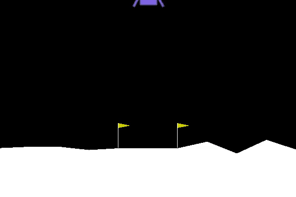

# soft-actor-critic

Implementation of the soft actor critic algorithm using Pytorch. Code kept as lean and clean
as possible on purpose.  

## Usage

### Train

```
python3 soft_actor_critic train
```

With some arguments:
```
python3 soft_actor_critic train --env-name MountainCarContinuous-v0 --learning-rate 0.001
```

### Eval

```
python3 soft_actor_critic eval --run-name name_of_my_last_run
```

With some arguments:
```
python3 soft_actor_critic eval --run-name name_of_my_last_run --hidden-units 512 512 --seed 2
```
(The environment name, and the hidden units need to correspond to the arguments in the run that is loaded)


## Help

```
python soft_actor_critic --help

usage: Use "python soft_actor_critic --help" for more information

PyTorch Soft Actor-Critic

positional arguments:
  {train,eval}  Selection of the mode to perform
    train       Create something
    eval        Evaluate the performance of an already trained agent

optional arguments:
  -h, --help    show this help message and exit
```

### Train help

```
python soft_actor_critic train --help

usage: Use "python soft_actor_critic --help" for more information train [-h] [--env-name] [--hidden-units  [...]]
                                                                        [--directory] [--seed] [--run-name]
                                                                        [--batch-size] [--memory-size]
                                                                        [--learning-rate] [--gamma] [--tau]
                                                                        [--num-steps] [--start-step] [--alpha]

optional arguments:
  -h, --help            show this help message and exit
  --env-name            Gym environment to train on (default: LunarLanderContinuous-v2)
  --hidden-units  [ ...]
                        List of networks' hidden units (default: [256, 256])
  --directory           Root directory in which the run folder will be created (default: ../runs/)
  --seed                Seed used for pytorch, numpy and the environment (default: 1)
  --run-name            Name used for saving the weights and the logs (default: generated using the "get_run_name"
                        function)
  --batch-size          Batch size used by the agent during the learning phase (default: 256)
  --memory-size         Size of the replay buffer (default: 1000000)
  --learning-rate       Learning rate used for the networks and entropy optimization (default: 0.0003)
  --gamma               Discount rate used by the agent (default: 0.99)
  --tau                 Value used for the progressive update of the target networks (default: 0.005)
  --num-steps           Number training steps (default: 1000000)
  --start-step          Step after which the agent starts to learn (default: 1000)
  --alpha               Starting value of the entropy (alpha) (default: 0.2)
```

### Evaluate help

```
python soft_actor_critic eval --help

usage: Use "python soft_actor_critic --help" for more information eval [-h] [--env-name] [--hidden-units  [...]]
                                                                       [--directory] [--seed] [--run-name]
                                                                       [--num-episodes] [--deterministic] [--render]
                                                                       [--record]

optional arguments:
  -h, --help            show this help message and exit
  --env-name            Gym environment to train on (default: LunarLanderContinuous-v2)
  --hidden-units  [ ...]
                        List of networks' hidden units (default: [256, 256])
  --directory           Root directory in which the run folder will be created (default: ../runs/)
  --seed                Seed used for pytorch, numpy and the environment (default: 1)
  --run-name            Run name of an already trained agent located in the "--directory" directory
  --num-episodes        Number of episodes to run (default: 3)
  --deterministic       Toggle deterministic behavior of the agent when interacting with the environment
  --render              Toggle the rendering of the episodes
  --record              Toggle the recording of the episodes (toggling "record" would also toggle "render")
```


## Equations

This is an attempt to show the equation of the paper, and their correspondence in the source code:

### Critic network Optimization

```python
def _critic_optimization(self, state: torch.Tensor, action: torch.Tensor, reward: torch.Tensor,
                         next_state: torch.Tensor, done: torch.Tensor) -> Tuple[float, float]:
    with torch.no_grad():
        next_action, next_log_pi = self.policy.evaluate(next_state)
        next_q_target_1, next_q_target_2 = self.target_critic.forward(next_state, next_action)
        min_next_q_target = torch.min(next_q_target_1, next_q_target_2)
        next_q = reward + (1 - done) * self.gamma * (min_next_q_target - self.alpha * next_log_pi)

    q_1, q_2 = self.critic.forward(state, action)
    q_network_1_loss = F.mse_loss(q_1, next_q)
    q_network_2_loss = F.mse_loss(q_2, next_q)
    q_loss = (q_network_1_loss + q_network_2_loss) / 2

    self.critic_optimizer.zero_grad()
    q_loss.backward()
    self.critic_optimizer.step()
    return q_network_1_loss.item(), q_network_2_loss.item()

```

### Policy Optimization 

```python
def _policy_optimization(self, state: torch.Tensor) -> float:
    with eval_mode(self.critic):
        predicted_action, log_probabilities = self.policy.evaluate(state)
        q_1, q_2 = self.critic(state, predicted_action)
        min_q = torch.min(q_1, q_2)

        policy_loss = ((self.alpha * log_probabilities) - min_q).mean()

        self.policy_optimizer.zero_grad()
        policy_loss.backward()
        self.policy_optimizer.step()
        return policy_loss.item()

```

### Entropy Optimization 

```python
def _entropy_optimization(self, state: torch.Tensor) -> float:
    with eval_mode(self.policy):
        _, log_pi = self.policy.evaluate(state)
        alpha_loss = -(self.log_alpha * (log_pi + self.target_entropy).detach()).mean()

        self.alpha_optimizer.zero_grad()
        alpha_loss.backward()
        self.alpha_optimizer.step()

        self.alpha = self.log_alpha.exp()
        return alpha_loss.item()

```


## Resources

List of repository that helped me to solve technical issues:
- [pytorch-soft-actor-critic](https://github.com/pranz24/pytorch-soft-actor-critic) 
- [Soft-Actor-Critic-and-Extensions](https://github.com/BY571/Soft-Actor-Critic-and-Extensions) 
- [spinningup](https://github.com/openai/spinningup) 

## Original papers:

Soft Actor-Critic Algorithms and Applications, Haarnoja et al. [[arxiv]](https://arxiv.org/abs/1812.05905v2) (January 2019)   
Soft Actor-Critic: Off-Policy Maximum Entropy Deep Reinforcement Learning with a Stochastic Actor, Haarnoja et al. [[arxiv]](https://arxiv.org/abs/1801.01290) (January 2018)
